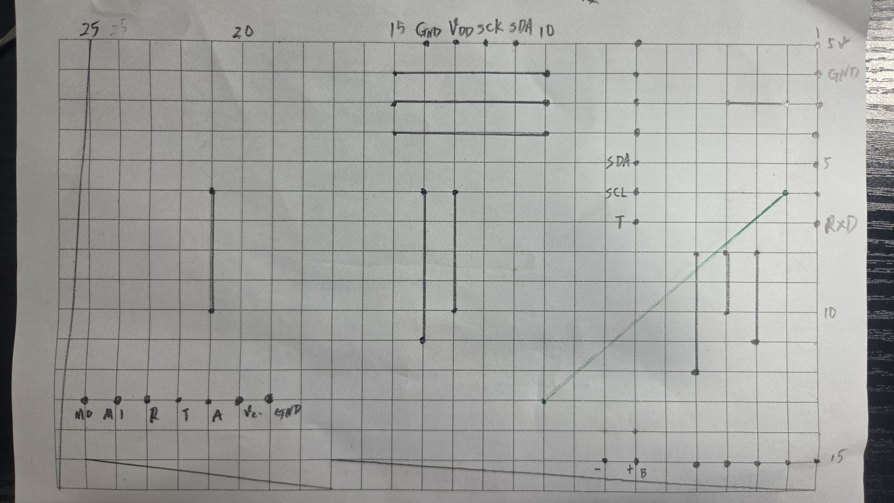
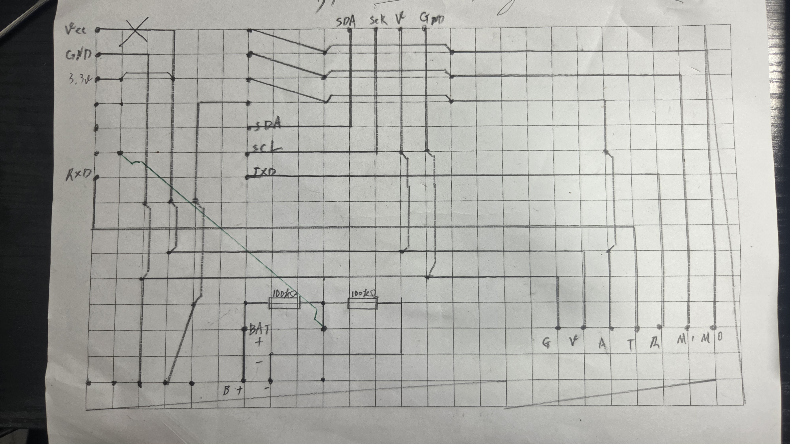
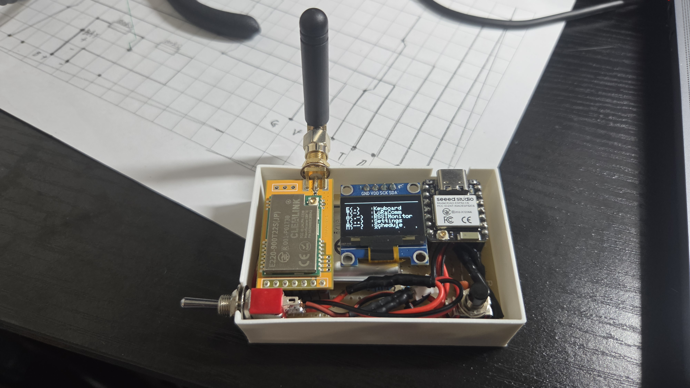

# MorseKeyboard-V2

このリポジトリではモールス信号を用いて、キーボード入力、[LoRA](https://ja.wikipedia.org/wiki/LoRa)通信を行うことができるシステムを開発しています。

## 概要

- Bluetoothを用いたキーボード入力
- [LoRA](https://ja.wikipedia.org/wiki/LoRa)通信を用いた機器同士の通信

### Bluetoothキーボード入力

モールス信号を用いて、Bluetoothキーボードとして動作することができます。  
これにより、モールス信号を入力することで、文字を打つことができます。

### LoRA通信

モールス信号を用いて、[LoRA](https://ja.wikipedia.org/wiki/LoRa)通信を行うことができます。
**このプロジェクトで作成した`E220`ヘッダは日本版のモジュールのみ対応しています。**

### 材料

- [ESP32C6](https://akizukidenshi.com/catalog/g/g129481/) 1100円
- [E220-900T22S](https://akizukidenshi.com/catalog/g/g131361/) (日本版) 1980円
- [ユニバーサル基板](https://akizukidenshi.com/catalog/g/g103229/) 130円
- [OLEDディスプレイ](https://www.amazon.co.jp/dp/B0GTV26DD2?ref=ppx_yo2ov_dt_b_fed_asin_title) 580円
- [800mAh Li-ionバッテリ](https://www.amazon.co.jp/dp/B0GTV26DD2?ref=ppx_yo2ov_dt_b_fed_asin_title) 990円
- アンテナ(920MHz) お好みでどおぞ

そのほか、ジャンパーワイヤやスイッチ、10kΩ抵抗、はんだ付け用の道具などが必要です。

### 配線

#### 表面

> [!NOTE]
> それぞれで配線を考えることをお勧めします。
> この配線では、Analogピンをすべて使用しているため、バッテリー電圧を測定できません。
> また、`esp32c6`の`GPIO 0`は、起動時にLOWにするとブートモードに入るため、LOWにしないように注意してください。

### 裏面

> [!NOTE]
> 裏面の配線にて5vではなく3.3vを使用する必要があります。
> 5vを使用すると、バッテリー駆動時に5vが供給されず正常に動作しません。

### 完成図

### 対応しているモールス信号

以下は、このシステムで対応しているモールス信号の一覧です。  
[Morse.hpp](./include/Morse.hpp)に定義されているモールス信号を参照しています。

|文字|モールス信号|
|---|---|
|A|・－|
|B|ー・・・|
|C|－・－・|
|D|－・・|
|E|・|
|F|・・－・|
|G|－－・|
|H|・・・・|
|I|・・|
|J|・ーー|
|K|－・ー|
|L|・－・・|
|M|－－|
|N|－・|
|O|－－－|
|P|・－－・|
|Q|－－・ー|
|R|・－・|
|S|・・・|
|T|ー|
|U|・・ー|
|V|・・・ー|
|W|・－－|
|X|ー・・ー|
|Y|ー・ーー|
|Z|ーー・・|
|0|ーーーーー|
|1|・ーーーー|
|2|・・ーーー|
|3|・・・ーー|
|4|・・・・ー|
|5|・・・・・|
|6|ー・・・・|
|7|ーー・・・|
|8|ーーー・・|
|9|ーーーー・|
|\n|・・・ー・－|
|\e|・－・－・|
|\b|・・・・・・・・|
